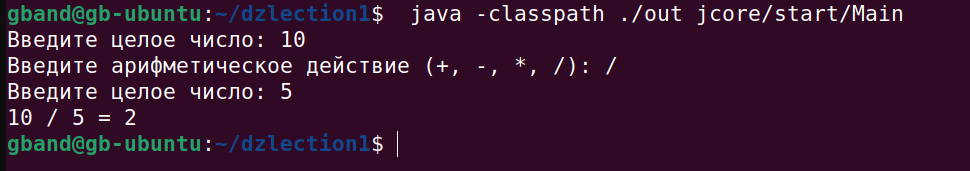
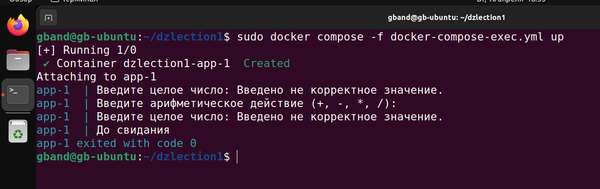

# Задание 1
## Создать проект из трёх классов (основной с точкой входа и два класса в другом пакете), которые вместе должны составлять одну программу, позволяющую производить четыре основных математических действия и осуществлять форматированный вывод результатов пользователю.

### Создана программа-калькулятор:

###	Результат работы программы:


### Содержание файла Main.java:
```
package calculate.jcore.start;

import jcore.calc.Calcluate;
import jcore.calc.Dialog;

/**
 *Основной метод являющийся точкой входа*
 *@param args*
 */
public class Main {

    public static void main(String[] args) {
        Calcluate calcluate = new Calcluate();
        System.out.println(calcluate.runCalculate());
            }
    } 
```
### Содержание файла Calculate.java
```
package calculate.jcore.calc;

public class Calcluate {
    protected int a;
    protected int b;
    protected int res;
    protected String act;

    Dialog dialog = new Dialog();

    /**
     * Программа калькулятора, возвращает String
     * @return
     */
    public String runCalculate(){
        a = dialog.invaiteForEnterNum();
        act = dialog.inviteForEnterAction();
        b = dialog.invaiteForEnterNum();
        switch (act) {
            case "+":
                this.res = a + b;
                break; 
            case "-":
                this.res = a - b;
                break;
            case "*":
               this.res = a * b;
                break;
            case "/":
                this.res = a / b;
                break;
            default:
                this.res = -2198345;
                break;
        }
        dialog.closeScan();
        if(res == -2198345) return "До свидания";
        else return String.format("%d %s %d %s %d", a,act,b,"=",res); 
    }
}
```

### Содержание файла Dialog.java:
```
package calculate.jcore.calc;

import java.util.Scanner;

public class Dialog {

Scanner scanner;

/**
* Метод ввода с консоли - возвращает Integer
* @param prompt
* @return
*/
public int invaiteForEnterNum(){
    System.out.print("Введите целое число: ");
            int num = 0;
            scanner = new Scanner(System.in);
        try {
            num = Integer.parseInt(scanner.nextLine());
        }catch (Exception e) {
            System.out.println("Введено не корректное значение.");
            }
    return num;
}

/**
 * Метод ввода с консоли, возвращает String
 * @return
 */
public String inviteForEnterAction(){
   String strAct = "";
    System.out.print("Введите арифметическое действие (+, -, *, /): ");
   scanner = new Scanner(System.in, "cp866");
try {
 strAct = scanner.nextLine();
}catch (Exception e) {
    System.out.println("");
}
return strAct;
}

        public void closeScan(){
    scanner.close();
}
} 
```

# Задание 2
## Скомпилировать проект, а также создать для этого проекта стандартную веб-страницу с документацией ко всем пакетам.

### Структура каталогов для программы Калькулятор: 

В пакете start – точка входа Main.java, и 
в отдельном пакете calc – классы Calculate.java и Dialog.java

gband@gb-ubuntu:~/dzlection1$ tree
```
.
├── calculate
│   └── jcore
│       ├── calc
│       │   ├── Calcluate.java
│       │   └── Dialog.java
│       └── start
│           └── Main.java
└── out
```
Компиляция проекта запущена командой:

__*gband@gb-ubuntu:~/dzlection1$ javac -sourcepath ./calculate -d out calculate/jcore/start/Main.java*__

В результате в каталоге out скомпилированы файлы с расширением .class:

__*gband@gb-ubuntu:~/dzlection1/out$ tree*__
```
.
└── jcore
    ├── calc
    │   ├── Calcluate.class
    │   └── Dialog.class
    └── start
        └── Main.class
```
Запуск проекта осуществляется командой:

__*gband@gb-ubuntu:~/dzlection1$ java -classpath ./out jcore/start/Main*__



Для создания документации используется команда Javadoc:

__*gband@gb-ubuntu:~/dzlection1$ javadoc -d docs -sourcepath calculate -cp out -subpackages jcore*__


В результате выполнения этой команды автоматически формируется документация в каталоге docs:

__*gband@gb-ubuntu:~/dzlection1$ tree*__
```
.
├── calculate
│   └── jcore
│       ├── calc
│       │   ├── Calcluate.java
│       │   └── Dialog.java
│       └── start
│           └── Main.java
├── docs
│   ├── allclasses.html
│   ├── allclasses-index.html
│   ├── allpackages-index.html
│   ├── constant-values.html
│   ├── deprecated-list.html
│   ├── element-list
│   ├── help-doc.html
│   ├── index-all.html
│   ├── index.html
│   ├── jcore
│   │   ├── calc
│   │   │   ├── Calcluate.html
│   │   │   ├── Dialog.html
│   │   │   ├── package-summary.html
│   │   │   └── package-tree.html
│   │   └── start
│   │       ├── Main.html
│   │       ├── package-summary.html
│   │       └── package-tree.html
│   ├── jquery
│   │   ├── external
│   │   │   └── jquery
│   │   │       └── jquery.js
│   │   ├── jquery-3.6.1.min.js
│   │   ├── jquery-ui.min.css
│   │   ├── jquery-ui.min.js
│   │   ├── jszip
│   │   │   └── dist
│   │   │       ├── jszip.js
│   │   │       └── jszip.min.js
│   │   └── jszip-utils
│   │       └── dist
│   │           ├── jszip-utils-ie.js
│   │           ├── jszip-utils-ie.min.js
│   │           ├── jszip-utils.js
│   │           └── jszip-utils.min.js
│   ├── jquery-ui.overrides.css
│   ├── legal
│   │   ├── ASSEMBLY_EXCEPTION
│   │   ├── jquery.md
│   │   ├── jqueryUI.md
│   │   ├── jszip.md
│   │   └── pako.md
│   ├── member-search-index.js
│   ├── member-search-index.zip
│   ├── overview-summary.html
│   ├── overview-tree.html
│   ├── package-search-index.js
│   ├── package-search-index.zip
│   ├── resources
│   │   ├── glass.png
│   │   └── x.png
│   ├── script.js
│   ├── search.js
│   ├── stylesheet.css
│   ├── type-search-index.js
│   └── type-search-index.zip
└── out
    └── jcore
        ├── calc
        │   ├── Calcluate.class
        │   └── Dialog.class
        └── start
            └── Main.class
```

# Задание 3
## Создать Makefile с задачами сборки, очистки и создания документации на весь проект.

Создание:
__*gband@gb-ubuntu:~/dzlection1$ nano Makefile*__
```
SRCDIR := calculate
OUTDIR := out
SUBPCKG := jcore

all:
	javac -sourcepath ./${SRCDIR}/ -d ${OUTDIR} ${SRCDIR}/${SUBPCKG}/start/Main.java
clean:
	rm -R ${OUTDIR}/ && mkdir out
run:
	cd ${OUTDIR}/ && java Main
doc:
	javadoc -d docs -sourcepath ${SRCDIR} -cp out -subpackages ${SUBPCKG}
```

В результате, можно использовать команды:

* Компиляция проекта – **make**
* Очистка результатов компиляции – **make clean**
* Запуск проекта – **make run**
* Документирование проекта – **make doc**

# Задание 4*
## Создать два Docker-образа. Один должен компилировать Java-проект обратно в папку на компьютере пользователя, а второй забирать скомпилированные классы и исполнять их.

Для упрощения был использован docker compose.

Создание первого docker-compose-file: 

__*gband@gb-ubuntu:~/dzlection1$ nano docker-compose-class.yml*__
```
services:
  app:
    image: bellsoft/liberica-openjdk-alpine:11.0.16.1-1
    command: javac -sourcepath ./src -d out ./src/jcore/start/Main.java
    volumes:
      - ./out:/out
      - ./calculate:/src
```
С помощью команды:

__*docker compose -f docker-compose-class.yml up*__

создается докер контейнер который компилирует проект в каталог out:


Создание второго docker-compose-file: 

__*gband@gb-ubuntu:~/dzlection1$ nano  docker-compose-exec.yml*__
```
services:
  app:
    image: bellsoft/liberica-openjdk-alpine:11.0.16.1-1
    command: java -classpath /out jcore.start.Main
    volumes:
      - ./out:/out
```
С помощью команды: 

__*gband@gb-ubuntu:~/dzlection1$ sudo docker compose -f docker-compose-exec.yml up*__

Запускается проект из каталога out:



# Задание 5*
## Создать docker-контейнер для формирования полной документации по проекту.

Создание docker-compose-file: 

__*gband@gb-ubuntu:~/dzlection1$ nano  docker-compose-docs.yml*__
```
services:
  app:
    image: bellsoft/liberica-openjdk-alpine:11.0.16.1-1
    command: javadoc -d docs -sourcepath /src -cp /out -subpackage jcore                
    volumes:
      - ./out:/out
      - ./calculate:/src
```
С помощью команды: 

__*gband@gb-ubuntu:~/dzlection1$ sudo docker compose -f docker-compose-docs.yml up*__

Запускается документирование проекта :


